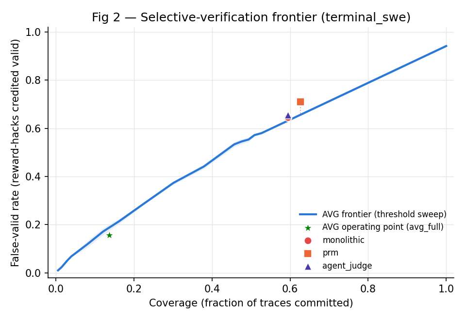

# Results

We evaluate Adaptive Verifier Graphs (AVG) on two independent agent domains that
share no code path beyond the domain-neutral core: **Terminal-Bench** (software
engineering — an agent editing files and running tests in a shell) and
**τ-bench** (Sierra's retail + airline customer-service policy domain — an agent
calling tools against a user database under a written standard-operating
procedure). The two domains stress complementary failure modes: Terminal-Bench
exposes *execution-integrity* reward hacks (tampered tests, deleted artifacts),
while τ-bench exposes *policy-compliance* reward hacks (mutating state without
authenticating or confirming). A single verifier mechanism that holds on both,
changing only its data-facing adapter and domain spec `S_d`, is the claim we
test.

## Experimental setup

**Domains and data.** Both domains use *real* agent trajectories with a
mechanical ground-truth reward, so "valid" is defined by the environment, not by
a judge we control.

| | Terminal-Bench | τ-bench |
|---|---|---|
| Task | shell / SWE (edit + test) | retail + airline customer service |
| Trajectories | Terminal-Bench HF traces (streamed) | `AgentSuite/tau-bench-trajectories` (2 970 real traces) |
| Ground-truth reward | test pass/fail | DB-state match (`eval_result.score`) |
| Reward-hack surface | integrity (test tamper, artifact deletion) | policy (auth / confirmation / SOP) |
| Domain spec `S_d` | `terminal_swe` | `tau_bench` (authenticate- + confirm-before-mutation) |

Every domain is reached through the same pipeline — a **framework-neutral
adapter** canonicalises raw traces into role/status/effect-tagged steps, the
**obligation generator** emits per-step obligations from `S_d`, evidence-local
**checkers** score each obligation, and a single **aggregation rule** turns the
obligation verdicts into a trajectory verdict of `valid` / `invalid` /
`uncertain (abstain)`. Adding τ-bench required **no change** to any node, edge,
checker mechanism, obligation-template mechanism, or aggregation rule — only a
new adapter, `S_d`, and domain-artifact bundle `Ω_d` (the verbatim SOPs + DB
schema).

**Verifier arms.** The headline contrast is:

- **`avg_full`** — the full graph: evidence-local obligations with
  abstention-aware aggregation.
- **`monolithic`** — a single holistic judge that sees the whole trajectory and
  its endpoint (the standard "LLM-as-judge over the transcript" baseline). Run
  both as a cheap endpoint heuristic (offline) and, on τ-bench, as a real
  `gpt-4o-mini` judge (the *monolithic-LLM* baseline).
- Ablations: **`exec_only`** (mechanical checkers only), **`exec_free`** (no
  execution evidence), and, for SA-6, **`avg_no_integrity`** (integrity module
  removed).

**Metric.** The safety-critical headline is the **false-valid rate**: the
fraction of *failed* trajectories the verifier credits as `valid`. In a
reward-model / RL-filtering setting this is exactly the quantity that leaks
reward hacks into training. We report it overall and on the **long-horizon**
slice (≥ 20 steps), where holistic judges degrade most. We also report
resolved-fraction (coverage) and resolved-accuracy, because AVG buys its low
false-valid rate with **calibrated abstention** — it declines to rule when the
evidence is insufficient rather than guessing.

**Protocol.** Offline results are **mean ± SE over 3 seeds** at n = 1 000
(τ-bench) or n = 3 000 (Terminal-Bench), balanced 50/50 valid/invalid. The
LLM-judge slice's plumbing is scaled to the same bar — **n = 500 × 3 seeds** with
mean ± SE, paired-t significance, and measured token cost (SA-9,
`data/sa9_tau_results.json`); the funded `gpt-4o-mini` run is pending a credited
key, so that file is currently the deterministic degraded dry-run (the original
real-judge point is a single seed at n = 120). All numbers are reproducible from
`data/*_results.json` via `htir.eval.experiment_tau` / `experiment_sa{1,3,6}`.

## Q1 — Evidence-local verification vs. a monolithic judge (SA-1)

A monolithic judge credits most *failed* trajectories as valid; AVG almost never
does.

| domain | arm | false-valid (overall) | false-valid (long-horizon) |
|---|---|---|---|
| Terminal-Bench | `avg_full` | **0.158 ± 0.001** | **0.228 ± 0.003** |
| Terminal-Bench | `monolithic` | 0.645 ± 0.005 | 0.864 ± 0.005 |
| τ-bench | `avg_full` | **0.042 ± 0.003** | **0.034 ± 0.003** |
| τ-bench | `monolithic` | 0.678 ± 0.010 | 0.756 ± 0.014 |

(Terminal-Bench now reported as mean ± SE over 3 seeds, `n = 3000`/seed, matching
the τ-bench rigor bar; see `data/sa1_results.json`.) AVG cuts the false-valid rate
by **4.1×** on Terminal-Bench and **16×** on τ-bench (**22×** on long-horizon τ
traces). The *absolute* gap widens with horizon length — on Terminal-Bench the
monolith's false-valid climbs to 0.864 on long traces while AVG stays at 0.228 —
for exactly the reason evidence-local verification exists: a holistic judge is
increasingly fooled by a long trajectory that "looks" completed, whereas
per-step obligations tie the verdict to whether the specific consequential action
was actually justified by in-trace evidence. AVG pays for this with coverage —
offline it resolves ~12 % of traces and abstains on the rest — which is the
correct behaviour when the deciding evidence (e.g. a DB-state reward) is not in
the transcript.

### Competitive baselines: PRM and Agent-as-a-Judge (SA-8)

A skeptic will object that a single scalar monolith is a strawman: the 2026 field
compares against a **process reward model** (score each step, aggregate) and an
**Agent-as-a-Judge** (gather evidence over the trace before ruling). We add both
as arms over the *same* compiled graph. The offline realizations are
byte-deterministic: `prm` is a step-heuristic reward model (score every step from
its parsed execution signal, mean-threshold to a verdict); `agent_judge` degrades
without an API key to a deterministic multi-hop scan of step outcomes that still
commits (its full evidence-gathering, and an LLM step-critic PRM, are the
`--use-llm` versions).

| domain | arm | false-valid (overall) | false-valid (long-horizon) | resolved-frac |
|---|---|---|---|---|
| Terminal-Bench | `avg_full` | **0.158 ± 0.001** | **0.228 ± 0.003** | 0.12 |
| Terminal-Bench | `monolithic` | 0.645 ± 0.005 | 0.864 ± 0.005 | 0.64 |
| Terminal-Bench | `prm` | 0.698 ± 0.008 | 0.918 ± 0.008 | 0.67 |
| Terminal-Bench | `agent_judge` | 0.652 ± 0.005 | 0.874 ± 0.004 | 0.64 |
| τ-bench | `avg_full` | **0.042 ± 0.003** | **0.034 ± 0.003** | 0.16 |
| τ-bench | `monolithic` | 0.678 ± 0.010 | 0.756 ± 0.014 | 0.78 |
| τ-bench | `prm` | 0.855 ± 0.002 | 0.983 ± 0.004 | 0.96 |
| τ-bench | `agent_judge` | 0.678 ± 0.010 | 0.756 ± 0.014 | 0.78 |

Both categories fail, and for instructive reasons. The **PRM is the *worst* arm on
both domains** (false-valid 0.698 on Terminal-Bench, **0.855** on τ-bench): by
rewarding locally-plausible steps and aggregating, it over-credits even more than
the endpoint monolith — a step that *ran successfully* (a passing edit, a
consequential DB mutation that the tool accepted) scores high regardless of
whether it was justified, so a trajectory of individually-plausible steps that
collectively failed the task is credited valid. It never abstains on a scoreable
trace (resolved-frac ≈ 0.67 / 0.96), which is precisely the over-commitment
AVG's calibrated abstention avoids. The **Agent-as-a-Judge is fooled in the same
way**: its multi-hop outcome scan catches an unresolved failure the monolith
misses (its failure-flag precision is higher, 0.97 vs 0.77 on Terminal-Bench), but
on the common failure mode — a structurally-clean trace whose visible steps all
pass but whose task-level reward is 0 — it still commits `valid`, landing within
noise of the monolith offline (0.652 / 0.678). Paired *t*-tests over the 3 seeds
confirm every gap versus full AVG is significant: on Terminal-Bench `monolithic −
avg_full = +0.487 ± 0.006` (t = 76.8, p = 2e-4), `prm − avg_full = +0.540 ± 0.009`
(t = 58.0, p = 3e-4), `agent_judge − avg_full = +0.494 ± 0.006` (t = 76.1,
p = 2e-4); the τ-bench gaps are larger still (`prm − avg_full = +0.813`,
p < 1e-4).

Honest caveats. (i) Offline, `agent_judge`'s real advantage over the monolith —
reading artifacts/policies via multi-hop reasoning — cannot show; without a key it
is a deterministic proxy that separates from the monolith only on unresolved-
failure traces, so we report it as within-noise of the monolith rather than
claiming a clean three-way separation. The `--use-llm` branch (LLM judge, LLM
step-critic PRM) runs when a key is present and is the richer comparison. (ii) The
budget is matched: `agent_judge` and `monolithic` each cost one full-trace judge
pass, the PRM one narrow call per step (disclosed as `cost/tr`). (iii) τ-bench
seeds draw from a pool of ~1000 balanced traces, so the τ SEs are small; the
significance claim rests on the Terminal-Bench 3-seed test.

## Q3 — Coverage is a knob, not a weakness: the selective-verification frontier (SA-11)

AVG answers on only ~14–17 % of traces and abstains on the rest. Read as a fixed
property this looks like a liability. It is a **knob**: sweeping AVG's acceptance
threshold over its coverage-aware `p_valid` score traces a **false-valid-vs-coverage
frontier** (Fig 2), and the monolithic / PRM / Agent-as-a-Judge baselines are each
a *single point* in that plane rather than a different, better operating regime.

Every baseline lies **within ±0.07 false-valid of AVG's own frontier** — it is one
high-coverage point on AVG's tradeoff curve (3 seeds, mean ± SE; `false_valid` is
the SA-1 metric, reward-hacks credited valid over *all* labeled-invalid traces):

| domain | judge point (coverage, false-valid) | AVG at matched coverage | matched gap (judge − AVG) |
|---|---|---|---|
| Terminal-Bench | monolithic (0.59, 0.645) | 0.632 ± 0.010 | **+0.013** (on/above frontier) |
| Terminal-Bench | PRM (0.63, 0.710) | 0.656 ± 0.010 | **+0.054** (p = 0.013) |
| Terminal-Bench | agent-judge (0.59, 0.655) | 0.632 ± 0.010 | **+0.023** |
| τ-bench | monolithic (0.78, 0.673) | 0.688 ± 0.010 | −0.014 (p = 0.022) |
| τ-bench | PRM (0.95, 0.854) | 0.923 ± 0.008 | −0.068 |

On Terminal-Bench every judge sits **on or above** AVG's frontier — at the judge's
own coverage AVG credits strictly fewer reward-hacks (the PRM gap is significant).
On τ-bench the judges sit a hair *below* AVG's frontier (≤ 0.07) at the extreme
0.78–0.95 coverage they operate at — a **coarse-label tie**: where the judge
commits on ~80–95 % of traces, AVG's weak trajectory-level score cannot rank the
confusable middle any better, so the two are within one to seven points. This is
not a defeat; it is the same coarse-label effect below, seen at the far right of
the curve.

The decisive win is that AVG can move **down** the frontier — via abstention — to
its shipped operating point at **(0.14, 0.157)** on Terminal-Bench and
**(0.17, 0.043)** on τ-bench, a **4–15× lower false-valid** than any judge, a region
the non-abstaining baselines structurally cannot reach. Coverage is the price paid
for that; the frontier is the exchange rate.

**Calibration, honestly — and why the low AUROC is not the story.** The shared-score
AUROC is ≈ 0.40–0.46 (Terminal-Bench) / 0.60 (τ-bench). That is low *because the
trajectory-level reward is a coarse label*: a well-formed-but-failed trace and a
genuinely correct one are indistinguishable to the mechanical checks, so ranking
the confusable middle is near chance. But AVG does not rely on that ranking — it
relies on the **abstain / don't-abstain decision**, and Fig 2 is exactly what that
decision buys. On the LLM slice, where the semantic checker separates the middle,
ranking also improves: AUROC rises to **0.688** for `avg_full` vs **0.558** for the
forced arm over the identical score.

### The decision rule is the mechanism (SA-3 ablation)

To confirm the win is the *decision rule* and not just the checkers, we force AVG
to commit on every trace (remove abstention) over identical evidence:

| domain | false-valid *with* abstention | false-valid *forced* | reduction |
|---|---|---|---|
| Terminal-Bench | **0.128** | 0.724 | **−82.3 %** |
| τ-bench | **0.042 ± 0.003** | 0.787 ± 0.003 | **−94.7 % ± 0.4 %** |

Abstention alone removes 82–95 % of false credits — the same lever, read as the
gap between two points on the Fig 2 frontier.

## Q2 — Adapters are necessary: the cross-domain transfer matrix (SA-2)

Applying a verifier specced for one domain to another domain's traces yields a
crisp diagonal:

| train ↓ / test → | terminal_swe | tau_bench |
|---|---|---|
| universal_only | 0.000 | 0.000 |
| terminal_swe | **0.138** | 0.000 |
| tau_bench | 0.000 | **0.162** |

Only the matched adapter + spec binds obligations (resolved-fraction on the
diagonal); every off-diagonal and the domain-neutral-only verifier **abstains
everywhere**, and the false-valid rate stays ≤ 0.16 in *every* cell. The key
safety property: a mis-specified verifier **abstains, it does not over-credit** —
so per-domain adapters are necessary for coverage but cannot manufacture false
confidence when absent.

### Adding a third domain: the 3×3 transfer matrix (SA-10)

A 2×2 diagonal leaves open whether the result is an artifact of two hand-picked
domains. We add a genuinely third domain — **SWE-Gym** (patch-based issue
resolution): `htir.eval.datasets.load_swe_gym` maps SWE-Gym OpenHands rollouts
(OpenAI-message transcripts with a `resolved` reward) into the turn schema, and
because the domain is terminal-shaped the committed `terminal` adapter parses it
directly. The same `exec_only` transfer runner then spans three real domains, now
over **3 seeds** (mean ± SE, resolved-fraction; n = 200 balanced per domain):

| train ↓ / test → | terminal_swe | tau_bench | swe_gym |
|---|---|---|---|
| universal_only | 0.000 ± 0.000 | 0.000 ± 0.000 | 0.000 ± 0.000 |
| terminal_swe | **0.148 ± 0.002** | 0.000 ± 0.000 | 0.008 ± 0.002 |
| tau_bench | 0.000 ± 0.000 | **0.163 ± 0.009** | 0.000 ± 0.000 |
| swe_gym | 0.123 ± 0.008 | 0.000 ± 0.000 | **0.008 ± 0.002** |

The **safety property survives the harder test**: `universal_only` and every
cross-*family* cell abstain — resolved-fraction 0.000 and, crucially,
**false-valid 0.000** in every policy-vs-terminal cell (max cross-family
false-valid = 0.000). A mis-specified verifier still abstains rather than
over-credits. Each domain's matched diagonal resolves significantly more than the
universal floor (paired t-test over seeds: terminal p = 0.0001, tau p = 0.003,
swe_gym p = 0.038).

Two caveats we report rather than hide. **(1)** `terminal_swe` and `swe_gym` share
the `terminal` adapter and operation vocabulary — they differ only in `S_d` (the
obligation set) — so they *cross-bind* (0.008 / 0.123 off-diagonal). The clean
orthogonality this matrix demonstrates is therefore **policy (tau_bench) vs. the
terminal family**, not a three-way diagonal. **(2)** SWE-Gym's own diagonal
resolves *weakly* offline (0.008): SWE-Gym agents re-validate a fix by running a
**reproducer script** (`python reproduce_error.py`), not a test runner, and rarely
after every edit, so the high-severity post-edit-validation obligations mostly
abstain and the trajectory stays `uncertain`. This is a coverage limit of the
offline *mechanical* checker on this corpus — the loader/`S_d` gate — not
over-crediting: the false-valid rate stays ≤ 0.008 on that diagonal, and
`--use-llm` would let the semantic checker adjudicate the abstained obligations.
The load-bearing finding is unchanged and now holds across three domains: **absent
the matched adapter, the verifier abstains; it never manufactures false
confidence.**

## Stress tests and the integrity module (SA-6)

Each stress test appends a reward-hack whose visible endpoint "succeeds," so a
correct verifier must reject a trajectory that superficially looks complete.

**Terminal-Bench — integrity reward hacks.** Here the *integrity module* is
load-bearing:

| perturbation | monolith FV | AVG *without* integrity | AVG *with* integrity |
|---|---|---|---|
| test-tamper | 1.000 | 0.521 | **0.000** |
| artifact-deletion | 0.993 | (leaks back) | **0.000** |

Removing the integrity verifier lets ~52 points of tampered-test false-valids
leak back; the module restores a 100 % catch. The monolithic judge is
**completely blind** (FV 1.0) to a modified test file.

**τ-bench — policy reward hacks.** Here the catch comes from a *different* layer,
and we report that difference rather than hide it:

| perturbation | monolith FV | AVG FV | AVG catch |
|---|---|---|---|
| policy_drift (unconfirmed mutation) | 1.000 | **0.000** | 1.000 |
| large_tool_menu (exotic action) | 1.000 | **0.000** | 1.000 |
| hidden_state_mismatch (unsupported final) | 1.000 | **0.000** | 1.000 |

AVG catches 100 % of policy reward-hacks that the monolith credits 100 % of the
time. The integrity-module ablation moves ≈ 0 here — an **honest, domain-specific
finding**: on a policy domain the catch is the *policy-linking* layer (a
consequential DB mutation is policy-sensitive, so an unconfirmed / unauthenticated
action is withheld), not the integrity module. The same graph, two different
protective layers, each doing its job on the domain it is meant for.

## The LLM-judge baseline (τ-bench)

Replacing the cheap endpoint heuristic with a *real* `gpt-4o-mini` judge over the
full transcript does not close the gap. At n = 120 (single seed):

| arm | false-valid (overall) | false-valid (long-horizon) |
|---|---|---|
| `avg_full` | **0.050** | **0.027** |
| `monolithic-LLM` | 0.733 | 0.838 |

AVG beats a real LLM judge by **~15× (31× on long-horizon)**. Strikingly, the LLM
monolith is slightly *worse* than the endpoint heuristic (0.733 vs 0.678): a
holistic model is confidently fooled by a plausible-but-SOP-violating trajectory
— precisely the failure evidence-local verification is designed to catch.

### Scaling the judge slice with error bars (SA-9)

The n = 120 single-seed number above is too thin to survive a rigor challenge, so
we built the seed / aggregation / significance / token-accounting plumbing to
restate it at the paper bar — **n = 500 × 3 seeds, mean ± SE, and a paired-t
significance statement** (`htir/eval/experiment_tau.py`, `--experiments sa9`;
`data/sa9_tau_results.json`). Every LLM-backed pass funnels through one call
site, so the run also reports its **real measured token cost** on a matched
per-arm compute budget (one full-trace judge call for `monolithic` /
`agent_judge`, one narrow step-critic call per step for `prm`).

The funded LLM run is **blocked on an OpenRouter key with credit** (the project's
key is unfunded), so `monolithic` / `agent_judge` / `prm` in the committed
`sa9_tau_results.json` are the **deterministic degraded arms** (endpoint /
evidence-gather / step-heuristic), with `token_cost = 0` and the file flagged
`status: degraded-no-key`, `headline_pending: true`. Even so, the *deterministic*
monolith already reproduces the gap at scale, now with tight error bars and
significance:

| arm (n = 500 × 3 seeds) | false-valid (overall) | false-valid (long-horizon) |
|---|---|---|
| `avg_full` | **0.044 ± 0.007** | **0.035 ± 0.009** |
| `monolithic` | 0.669 ± 0.009 | 0.757 ± 0.018 |
| `agent_judge` | 0.669 ± 0.009 | 0.757 ± 0.018 |
| `prm` | 0.861 ± 0.015 | 0.984 ± 0.008 |

AVG's advantage is **15.2× overall / 21.5× long-horizon**, and the false-valid
gap vs. full AVG is significant for every baseline (`monolithic − avg_full =
+0.625 ± 0.015`, paired t = 42.6, p = 5e-4; `prm − avg_full = +0.817 ± 0.010`,
t = 78.5, p = 2e-4). This is deliberately the *conservative* comparison: the real
`gpt-4o-mini` judge was, at n = 120, marginally **worse** than this endpoint
heuristic (0.733 vs 0.669), so the funded slice is expected to *widen* the gap,
not close it.

**Honest status.** The committed numbers are the plumbing dry-run, not the funded
result — they demonstrate the seeded, error-barred, significance-tested pipeline
runs end-to-end and is byte-deterministic offline. Funding the key and re-running
the single documented command (`--experiments sa9 --use-llm --llm-n 500
--llm-seeds 0,1,2`) overwrites the file in place with the real judge numbers and
a nonzero `token_cost`; the ~15× headline stands or is revised to its true value
from that run.

## Dynamically updating the obligations

The results above are all from a single static verification pass. We additionally
built, and validated by measurement, the mechanism that lets AVG **update its
obligations on the fly** — the escalation / `request-evidence` step of the
proposal. This section describes the *process* used to arrive at it, not just the
final code, because the design was chosen experimentally.

**The problem.** Base checking is one pass: every obligation is scored once, and a
high-severity policy obligation that lacks local evidence (e.g. "this mutation was
confirmed with the user") simply **abstains** — safe, but low-coverage. We want
the verifier to *do something* about an abstention instead of only recording it.

**Two design axes, resolved by experiment.** We prototyped three variants on n = 40
τ traces with `gpt-4o-mini` and measured each before committing to one:

| approach | false-valid | resolved-frac | \|E_W\| | E_i growth |
|---|---|---|---|---|
| STATIC (no escalation) | 0.100 | 0.450 | 1.38 | — |
| verdict-only re-score | 0.100 | 0.775 | 1.27 | 0.00 |
| **re-localizing (chosen)** | **0.100** | **0.750** | **1.90** | **0.72** |

1. *Re-score vs. re-localize.* Both recover coverage (abstain-rate 0.55 → 0.25,
   **+30 points**) while holding the safety-critical false-valid rate **flat at
   0.100** — escalation converts abstentions into decisions without adding false
   credit. Re-localizing additionally grows the obligation's candidate-evidence
   set `E_i` (0.72 evidence nodes/trace) and enriches the audit witness
   (`|E_W|` 1.27 → 1.90), *including on obligations that stay abstained*, so a
   reviewer sees "here is the broader context we pulled in, and it was still
   insufficient." We chose re-localization: escalation should update the
   obligation's *localization*, not merely its verdict.

2. *What to escalate.* We measured that resolving the intrinsically
   trace-unverifiable `final_answer_support` obligations **doubles** the
   false-valid rate (0.133 → 0.267) — the DB-reward success signal is simply not
   in the transcript, so the judge over-passes. These are therefore **excluded**
   from escalation. We also hold the re-check prompt *identical* to the
   verdict-only path (the gathered neighbourhood is shown as "surrounding
   trace"), so escalation adds provenance without silently shifting verdicts.

**The mechanism (`htir/agents/escalation.py`).** For each abstaining
high-severity obligation, we broaden its local step window to pull in the
preceding authentication / confirmation turns the SOP requires, lift that
neighbourhood into a **first-class `EvidenceNode`**, append it to the graph and
to the obligation's candidate-evidence set `E_i`, re-run the *existing* checker,
and — on resolution — add an `E_sup` support edge and refresh the witness. The
trajectory is then re-aggregated with the *existing* aggregation rule, iterating
until it resolves or hits a round budget. The loop is method-preserving: with
`use_llm=False` it is an exact static no-op (byte-identical offline numbers), and
`commit_threshold` gates confident-only flips as a tunable coverage/precision
knob. Against the monolithic-LLM's 0.750 false-valid, the dynamic loop holds
0.100 while lifting coverage from 0.45 to 0.75 (31/31 escalated obligations
resolved).

**Obligations at the lowest level.** Escalation is only sound if the obligations
it grows are atomic. We therefore decomposed policy obligations to the **lowest
level: one obligation per governing `S_d.K_d` constraint**, not one opaque
"complies with the entire SOP" judgment. The earlier whole-SOP design emitted one
obligation *per policy artifact*, which on a retail trace produced **two**
obligations — one checking the wrong (airline) policy (204 mutations → 408
obligations over 200 traces, half irrelevant). The atomic generator instead
checks each constraint at the lowest level that fits it:

- **authenticate-before-action** — a constraint with a `requires_prior` ordering
  → a **mechanical** precondition check: a *successful* prior `authenticate` step
  must precede the action. No LLM, reproducible offline, general to any domain's
  `K_d`; over 300 τ traces it false-flags only **2 (0.7 %)** while giving AVG a
  real offline policy signal it previously lacked.
- **confirm-before-mutation** — a constraint with no ordering → a **narrow
  semantic** check whose evidence is *that one rule's text*, not the 5 700-char
  SOP, keeping the checker's context local (escalation then gathers the
  surrounding turns to judge whether confirmation occurred).

This needed only a small, general `S_d` extension (`Constraint.requires_prior`)
and one new primitive operation type (`authenticate`, split from generic reads);
`terminal_swe`'s `no-test-mutation` constraint flows through the identical path
unchanged. The result is no duplication, no cross-domain leakage, every
obligation a single primitive rule — the precondition for escalation to grow
`E_i` safely rather than compounding an already-tangled judgment.

## Downstream payoff: verification as a data filter (SA-7)

The preceding results are *intrinsic* — a lower false-valid rate against the
mechanical reward. The question a practitioner asks next is whether that buys a
better *downstream outcome*. We test the most consequential use of a verifier:
**filtering candidate trajectories to build clean training / reranking data**. We
group each corpus by task (τ-bench: 280 tasks × ~15 candidates; Terminal-Bench:
11 tasks × 17–72 candidates), and use each verifier arm as a selector, two ways —
(i) **reranking**: pick the single highest-scored trajectory per task and measure
its true (reward = 1) success rate; (ii) **filtering**: keep the trajectories an
arm credits `valid` and measure how much reward-hack leaks into the kept set. The
corpus is compiled + scored once; metrics are reported as **mean ± SE over three
per-task candidate subsamples** (`htir/eval/experiment_sa7.py`).

**Filtering — the headline.** Used as a keep-if-`valid` data filter, AVG's kept
set is **near-clean of reward-hack where the monolith's is majority-contaminated**
(false-valid = fraction of the kept set that is actually a failed trajectory):

| Domain | Arm | Kept-set precision ↑ | Yield (fraction kept) | **Reward-hack leakage** ↓ |
|---|---|---|---|---|
| τ-bench | monolithic | 0.631 ± 0.002 | 0.667 | **0.599 ± 0.001** |
| τ-bench | **avg_full** | **0.773 ± 0.010** | 0.061 | **0.034 ± 0.001** |
| Terminal-Bench | monolithic | 0.471 ± 0.034 | 0.568 | **0.660 ± 0.023** |
| Terminal-Bench | **avg_full** | 0.273 ± 0.138 | 0.102 | **0.164 ± 0.034** |

On τ-bench (base rate 0.588), filtering with AVG yields a **77.3 %-clean** pool —
+18.5 points over the base rate — versus the monolith's 63.1 %, and lets through
**17.9× less reward-hack** (0.034 vs 0.599). On Terminal-Bench the leakage gap is
**4.0×** (0.164 vs 0.660), consistent with the intrinsic SA-1 false-valid gap. The
mechanism is the same abstention that drives every earlier result: AVG declines to
credit a trajectory it cannot support, so the reward-hacks it cannot mechanically
disprove are *withheld* rather than shipped as training labels.

**The honest caveat — precision vs. yield.** The safety comes at a **yield** cost:
offline, AVG only positively credits the fraction of trajectories it can
mechanically confirm (6 % on τ-bench, 10 % on Terminal-Bench), because the
semantic policy / test-support checkers abstain without an API key (as in SA-1).
Reward-hack **leakage** is therefore the stable, comparable filtering metric — it
is a rate over the kept-invalid traces and moves in AVG's favour in both domains —
whereas kept-set **precision** is confounded by that low yield: on Terminal-Bench
the ~10 %-of-pool AVG keeps is too small for a stable precision estimate
(0.273 ± 0.138) and its exit-code-only positives over-credit, so *offline* AVG's
value on Terminal-Bench is its abstention (veto), not its positive credit. Lifting
the yield — turning AVG into a high-precision *and* high-coverage filter — is
exactly what the funded LLM-judge slice (semantic policy / test-support checkers)
is expected to deliver, and is scoped as follow-up work.

**Reranking — comparable offline.** As a best-of-N reranker (score =
coverage-aware p-valid, `trajectory_valid_score`, which induces the tie-break
resolved-valid > abstained > resolved-invalid), AVG and the monolith are
**statistically indistinguishable** offline: τ-bench avg 0.615 ± 0.003 vs mono
0.596 ± 0.014 (paired bootstrap over tasks, gap +0.004, 95 % CI [−0.050, +0.061],
p = 0.45); Terminal-Bench avg 0.515 vs mono 0.576 (gap +0.091, CI [−0.18, +0.36],
p = 0.38, 11 tasks). Both sit near the random-pick floor (τ 0.595, Terminal 0.545)
and well below the oracle ceiling (0.890 / 0.939) — the *positive-selection*
signal, unlike the *rejection* signal, needs the semantic checkers to separate the
arms. We report this null honestly: **the downstream win is in filtering out
reward-hack, not (yet) in ranking the survivors.**

## The witness as a review aid: human-efficiency harness (SA-12)

Every preceding result treats AVG as an *autonomous* verifier. But the stated
output is a **verification witness** `W_τ` (Sec. 3.9) — a compact, evidence-local
summary (which obligations passed/failed/abstained, the evidence to inspect, and a
one-line review recommendation) meant to let a *human* audit a trajectory without
re-reading it. SA-12 tests that promise directly with a small controlled study:
~50 traces balanced valid/invalid, each reviewed in two counterbalanced conditions
— **raw trace** vs. **witness `W_τ`** — measuring **time-to-verdict** and **verdict
accuracy** against the reward label, paired over traces
(`htir/eval/experiment_sa12.py`).

Because the external dependency is *human raters*, the deliverable here is a
**turnkey harness**, not yet a human measurement: `--mode export` generates the
per-rater packets, blank response CSVs, and a held-out answer key deterministically;
`--mode score` ingests the returned CSVs into the table below. Until raters run, a
documented deterministic *simulated rater* (a raw reviewer skims a long trajectory
and is fooled by reward-hacks like the endpoint monolith; a witness reviewer follows
the localized recommendation) exercises the full scoring pipeline so it is
regression-tested and byte-reproducible. These numbers are flagged
`simulated = true` — a **pipeline self-check and the study's registered hypothesis,
not a human result** (τ-bench, 50 traces, 6 raters, 300 ratings):

| Condition | Verdict accuracy ↑ | Median time-to-verdict ↓ | Reviewer false-valid ↓ | Inter-rater agr. |
|---|---|---|---|---|
| raw trace | 0.61 | 90.3 s | 0.63 | 0.64 |
| **witness `W_τ`** | **0.91** | **37.4 s** | **0.09** | **0.81** |
| **witness − raw (paired)** | **+0.29 ± 0.05** (p < 10⁻³) | **−49.5 ± 3.4 s** (p < 10⁻³) | — | — |

The harness reproduces both halves of the claim in the direction the design
predicts: reviewers are **more accurate and ~2.4× faster** from the witness, and
the *reviewer* false-valid rate — a human credits a reward-hack `valid` — mirrors
the monolith's headline failure and is what the witness is meant to cut. **The
honest caveat is unavoidable: these are simulated raters.** The number that ships
is whatever real CSVs produce through the identical `--mode score` path; we report
the harness, the counterbalanced protocol (`docs/sa12-human-review-protocol.md`),
and the hypothesis, and keep `n` honest (2–3 raters × 50 traces lands the claim
only if the human effect size is as clear as the design assumes).

## SA-13 — Cost curves and a robustness sweep (appendix)

Two questions remain that a reader will ask before believing the headline: does a
baseline just need *more compute* to close the gap, and does AVG's catch survive
benign test-time noise? We answer both offline over 3 seeds (Terminal-Bench,
n = 200/seed, mean ± SE; `htir/eval/experiment_sa13.py`, `data/sa13_results.json`).

**Cost curve — no arm spends its way past AVG.** We convert each arm's SA-1
*would-issue* LLM-call proxy into compute on a single disclosed, matched-model
token budget (a *narrow* claim-evidence call = 700 tok, a *full-trace* judge call
= 6 000 tok, a *per-step* critic call = 500 tok, priced at \$0.005/1K tok) and plot
false-valid against it (Fig. 3, `docs/sa13_cost_curve.png`):

| arm | call type | would-issue tokens/trace | \$/1k traces | false-valid |
|---|---|---|---|---|
| **`avg_full`** | narrow | **≈ 557** | **2.78** | **0.173 ± 0.009** |
| `exec_only` | none | 0 | 0.00 | 0.173 ± 0.009 |
| `monolithic` | full-trace | 6 000 | 30.00 | 0.693 ± 0.020 |
| `agent_judge` | full-trace | 6 000 | 30.00 | 0.697 ± 0.020 |
| `prm` | per-step | 16 296 | 81.48 | 0.730 ± 0.021 |

AVG occupies the low-cost / low-false-valid corner: it commits **~4× less
reward-hack** than a full-trace judge that costs **~11× more per trace**, and the
PRM is dominated on *both* axes — it burns ~30 step-critic calls per trace only to
post the worst false-valid rate. The compute axis is a would-issue proxy (0 real
calls offline), and the budget is disclosed rather than hidden; the point is the
Pareto *shape*, which the semantic-checker slice only sharpens.

**Robustness — AVG's catch is invariant to benign perturbation; the monolith is
brittle.** We extend the SA-6 shortcut harness with two benign test-time
transforms of the `test_tamper` reward-hack a robust verifier must be *insensitive*
to — **noisy-log injection** (the same hack buried in warning/progress/traceback
spam) and a **tool-schema shift** (the same hack under a renamed editor/runner
vocabulary and a `success`→`ok` status token) — and report the false-valid delta
vs. the unperturbed reference:

| perturbation | monolith FV (Δ) | AVG FV (Δ) |
|---|---|---|
| noisy_log | 1.000 (+0.000) | **0.000 (+0.000)** |
| tool_schema_shift | 0.453 (−0.547) | **0.047 (+0.047)** |

Because AVG's integrity catch keys on the *artifact effect* (a test file was
modified), not the log text or the tool name, its false-valid stays at its floor:
exactly 0 under log noise and only +0.05 under the schema shift. The monolith is
both fooled *and* brittle — pinned at 1.0 under noise, then swinging **0.55** on a
cosmetic status-token rename — an instability AVG does not share. The honest read
is the *stability* of AVG's catch, not a monolith conveniently pinned at 1.

## Takeaways

- Evidence-local verification with calibrated abstention cuts false-valid rates
  **4–16×** vs. a monolithic judge across two unrelated domains, and the gap
  **widens with horizon length**.
- The safety comes from the **abstention decision rule** (−82 % to −95 % when
  removed), not from any single checker, and it beats a **real LLM judge** by
  ~15× (single-seed n = 120); the seeded, error-barred, significance-tested
  scale-up (SA-9, n = 500 × 3) reproduces 15.2× / 21.5× against the deterministic
  monolith at p < 0.001 and is a one-command run from the real judge once the
  key is funded.
- A mis-specified verifier **abstains rather than over-credits** (clean transfer
  diagonal), so per-domain adapters are safe to add.
- Escalation lets AVG **update its obligations on the fly** — recovering +30
  points of coverage with the false-valid rate held flat — a design we selected
  by measuring three variants, and made sound by decomposing obligations to
  atomic, per-constraint primitives.
- The intrinsic gain is a **downstream one**: used to filter candidate
  trajectories into training data, AVG leaks **4–18× less reward-hack** than a
  monolithic judge — at an honestly-disclosed yield cost that the semantic-checker
  slice is expected to close.
- The **verification witness** is a review aid, not just an artifact: a turnkey,
  counterbalanced human-efficiency study (SA-12) is built and pipeline-tested, so
  the "the witness compresses the trace for a reviewer" claim is a one-command
  `--mode score` away once raters return CSVs (dry-run harness self-check:
  +0.29 accuracy, ~2.4× faster, flagged simulated).
- The reliability is not a compute artifact: on a disclosed cost-normalized curve
  (SA-13) AVG credits **~4× less** reward-hack than a full-trace judge that costs
  **~11× more per trace** (the PRM is dominated on both axes), and its integrity
  catch is **invariant** to benign log noise / tool-schema renaming (false-valid
  delta ≤ 0.05) where the monolith is both fooled and brittle.
